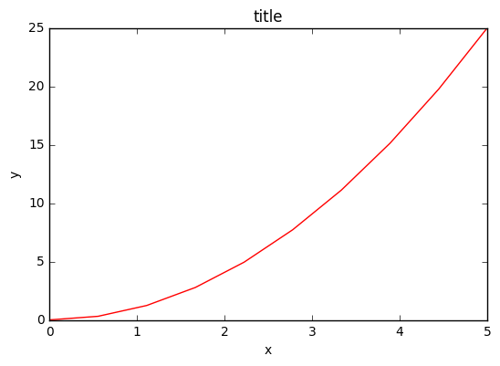
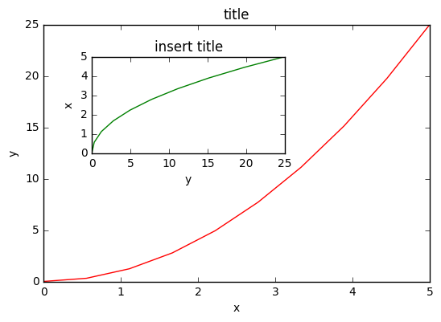
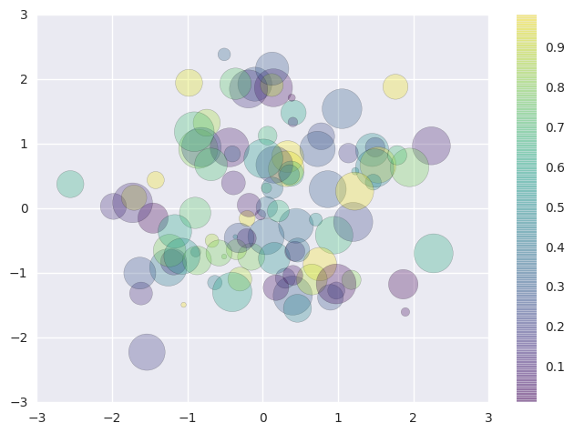
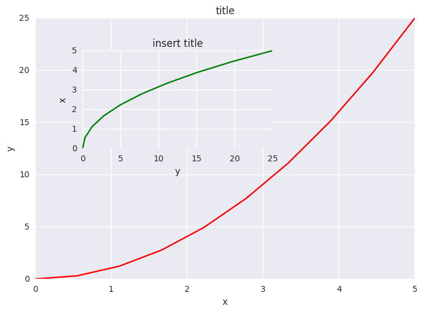

# plotting

> ## Learning Objectives
> *  Matplotlib is Object Oriented
> *  Plot data with matplotlib and seaborn 
> *  Look ahead: Interactive visualisation with Bokeh


## Matplotlib and notebooks

Matplotlib is an excellent 2D and 3D graphics library for generating scientific figures. Some of the many advantages of this library include:
* Easy to get started
* Support for $\LaTeX$ formatted labels and texts
* Great control of every element in a figure, including figure size and DPI.
* High-quality output in many formats, including PNG, PDF, SVG, EPS, and PGF.

In the jupyter notebook environment, there is a single command that imports both matplotlib, and configures the notebook so that figure show up in the notebook (rather than in a seperate viewer window).

```python
%pylab inline
```

For consistentcy, note that this Notebook _magic command_ is actually running:

```python
from matplotlib import pyplot as plt
import numpy as np
```

We prefer the explicit imports of these libraries in addition to ` %pylab inline`.

## Object oriented programming

The main idea with object-oriented programming is to have objects that one can apply functions and actions on, and no object or program states should be global (such as the MATLAB-like API). The real advantage of this approach becomes apparent when more than one figure is created, or when a figure contains more than one subplot. 

Let's start out by creating some toy data:

```python
x = np.linspace(0, 5, 10)
y = x ** 2
```

To use the object-oriented API we start out we store a reference to the newly created figure instance in the fig variable, and from it we create a new axis instance axes using the add_axes method in the Figure class instance fig:

```
fig = plt.figure()
axes = fig.add_axes([0.1, 0.1, 0.8, 0.8]) # left, bottom, width, height (range 0 to 1)
axes.plot(x, y, 'r')
axes.set_xlabel('x')
axes.set_ylabel('y')
axes.set_title('title')
```




Although a little bit more code is involved, the advantage is that we now have full control of where the plot axes are placed, and we can easily add more than one axis to the figure:

```python
fig = plt.figure()
axes1 = fig.add_axes([0.1, 0.1, 0.8, 0.8]) # main axes
axes2 = fig.add_axes([0.2, 0.5, 0.4, 0.3]) # inset axes

# main figure
axes1.plot(x, y, 'r')
axes1.set_xlabel('x')
axes1.set_ylabel('y')
axes1.set_title('title')

# insert
axes2.plot(y, x, 'g')
axes2.set_xlabel('y')
axes2.set_ylabel('x')
axes2.set_title('insert title');
```



If we don't care about being explicit about where our plot axes are placed in the figure canvas, then we can use one of the many axis layout managers in matplotlib. My favorite is subplots, which can be used like this:

```python
fig, axes = plt.subplots(nrows=1, ncols=2)
for ax in axes:
    ax.plot(x, y, 'r')
    ax.set_xlabel('x')
    ax.set_ylabel('y')
    ax.set_title('title')
```

A scatter plot is easy too!

```python
rng = np.random.RandomState(0)
x = rng.randn(100)
y = rng.randn(100)
colors = rng.rand(100)
sizes = 1000 * rng.rand(100)
```

```python
fig, ax = plt.subplots()
s = ax.scatter(x, y, c=colors, s=sizes, alpha=0.3,
            cmap='viridis')
fig.colorbar(s)  # show color scale
```



## Seaborn and bokeh

Seaborn is a Python visualization library based on matplotlib. It provides a high-level interface for drawing attractive statistical graphics. 

A very simple use of seaborn is to change the default plotting styles for matplotlib:

```python
import seaborn as sns #seaborn defaults
```
```python
fig, axes = plt.subplots(nrows=1, ncols=2)
for ax in axes:
    ax.plot(x, y, 'r')
    ax.set_xlabel('x')
    ax.set_ylabel('y')
    ax.set_title('title')
```



As well changing the default style of out matplotlib plots, Seaborn excels in predefined, out-of-the-box-plots. The emphasis is on statistical distrubutions:

```python
x = np.random.normal(size=100)
sns.distplot(x);
```


Bokeh is a Python interactive visualization library that targets modern web browsers for presentation. Its goal is to provide elegant, concise construction of novel graphics in the style of D3.js, and to extend this capability with high-performance interactivity over very large or streaming datasets. Bokeh can help anyone who would like to quickly and easily create interactive plots, dashboards, and data applications.


Firstly, you may have to download the bokeh library, we should be able to do this from the notebook:

```
!pip install bokeh
```
Now we'll load the bokeh modules we need:

```python
from bokeh.layouts import gridplot
from bokeh.plotting import figure, show, output_file
from bokeh.io import output_notebook
from bokeh.embed import file_html
```

And configure the Jupyter notebook output:

```python
output_notebook()
```
Now we'll create some bokeh figure objects

```python
x = np.linspace(0, 4*np.pi, 100)
y = np.sin(x)

TOOLS = "pan,wheel_zoom,box_zoom,reset,save,box_select"

p1 = figure(title="Legend Example", tools=TOOLS)
p1.circle(x,   y, legend="sin(x)")
p1.circle(x, 2*y, legend="2*sin(x)", color="orange")
p1.circle(x, 3*y, legend="3*sin(x)", color="green")

p2 = figure(title="Another Legend Example", tools=TOOLS)
p2.circle(x, y, legend="sin(x)")
p2.line(x, y, legend="sin(x)")
p2.line(x, 2*y, legend="2*sin(x)",
        line_dash=(4, 4), line_color="orange", line_width=2)
p2.square(x, 3*y, legend="3*sin(x)", fill_color=None, line_color="green")
p2.line(x, 3*y, legend="3*sin(x)", line_color="green")
```

Finally, open the plot in a notebook:

```
show(gridplot(p1, p2, ncols=2, plot_width=400, plot_height=400))  # open a notebook
```

We could also save the html for these figures and view directly in a web browser:

```python
from bokeh.resources import CDN
html = file_html(p1, CDN, "my plot")
with open('test.html', 'w') as f:
    f.write(html)
```

Note that by using a Jupyter magic, we can even load that html into the notebook.

```python
%%html
test.html
```


<!--sec data-title="Focus on the positives" data-id="challenge1" data-show=true ces-->


The code below creates a 1-d array of values. 

```python
x = np.linspace(0,20*np.pi, 200)
```

Create another array that gives the `sin` function of this array. Then set all value less than zero to zero. Finally, plot the result.


<!--endsec-->
